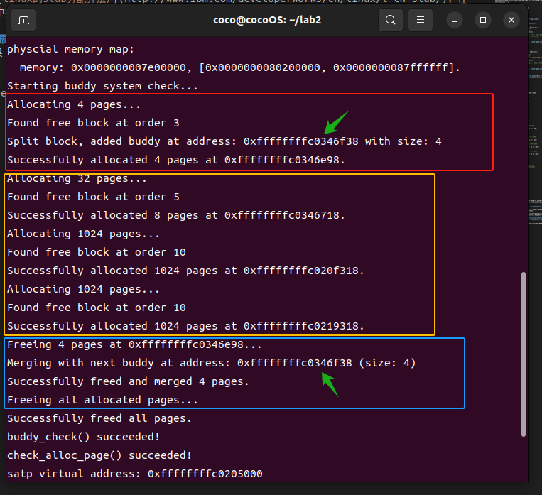

#### 练习0：填写已有实验

本实验依赖实验1。请把你做的实验1的代码填入本实验中代码中有“LAB1”的注释相应部分并按照实验手册进行进一步的修改。具体来说，就是跟着实验手册的教程一步步做，然后完成教程后继续完成完成exercise部分的剩余练习。

#### 练习1：理解first-fit 连续物理内存分配算法（思考题）
first-fit 连续物理内存分配算法作为物理内存分配一个很基础的方法，需要同学们理解它的实现过程。请大家仔细阅读实验手册的教程并结合`kern/mm/default_pmm.c`中的相关代码，认真分析default_init，default_init_memmap，default_alloc_pages， default_free_pages等相关函数，并描述程序在进行物理内存分配的过程以及各个函数的作用。
请在实验报告中简要说明你的设计实现过程。请回答如下问题：
- 你的first fit算法是否有进一步的改进空间？

#### 练习2：实现 Best-Fit 连续物理内存分配算法（需要编程）
在完成练习一后，参考kern/mm/default_pmm.c对First Fit算法的实现，编程实现Best Fit页面分配算法，算法的时空复杂度不做要求，能通过测试即可。
请在实验报告中简要说明你的设计实现过程，阐述代码是如何对物理内存进行分配和释放，并回答如下问题：
- 你的 Best-Fit 算法是否有进一步的改进空间？

#### 扩展练习Challenge：buddy 

**Buddy System（伙伴系统）**是一种内存分配算法，用于管理计算机内存的动态分配和释放。它的设计目标是减少内存碎片，并提高内存分配和释放的效率。以下是伙伴系统的主要特点和工作原理：

### buddy system的原理
#### 1. 工作原理

- **内存分块**：内存被分成若干个大小为 \(2^n\) 的块（页），每个块被称为一个“伙伴”。这种大小的选择使得可以方便地将块分割和合并。

- **分配方式**：当请求分配一块内存时，系统会找到一个适合的块。如果没有合适的块，系统会寻找一个更大的块进行分割，直到得到所需大小的块。

- **伙伴合并**：当释放内存时，系统会检查相邻的伙伴块（即在物理内存中紧邻的块）。如果这些伙伴块都是空闲的，系统会将它们合并成一个更大的块，减少内存碎片。

#### 2. 内存分配

分配过程
由小到大在空闲块数组中找最小的可用空闲块
如空闲块过大，对可用空闲块进行二等分，直到得到合适的可用空闲块。
被等分的两个内存块在内存上是连续的，称为buddy（伙伴）

#### 3. 内存释放

释放过程
- 把释放的块放入空闲块数组
- 合并满足合并条件的空闲块
合并条件
- 大小相同
- 地址相邻
- 低地址空闲块起始地址为2i+1的倍数


这个代码实现了一个简单的伙伴系统（Buddy System）内存管理器，用于动态分配和释放物理内存页。以下是代码的详细介绍：

### 设计buddy system
#### 1. 数据结构
课堂上介绍的buddy system是用二维数组完成的，在之前的实验中我们发现已经实现了list，所以可以使用list来进行管理。
课堂上介绍的buddy system最开始是一个最大的2^u的块，在linux的实现中使用11个链表管理1-4096页大小的内存。我们可以用**list_entry_t**来实现。
- **free_area_t[MAX_ORDER]**: 一个结构体数组，表示每个阶（order）下的空闲页块信息。每个结构体包含两个成员：
  - `free_list`: 表示当前阶的空闲页块链表。
  - `nr_free`: 当前阶的空闲页块数量。

- **Page**: 代表一页物理内存的结构体，包含标志和属性信息。

#### 2. 初始化函数

- **buddy_init()**: 初始化每个阶的空闲链表，并将空闲页数量设为零。
  
```c++
static void
buddy_init(void) {
    for(int i=0;i<MAX_ORDER;i++){
        list_init(& free_area[i].free_list);
        free_area[i].nr_free = 0;
    }
}
```


- **buddy_init_memmap(struct Page *base, size_t n)**: 初始化给定内存范围内的页面，将它们标记为可用并将其加入到适当的空闲链表中。当内存初始化时，按照最大的可能块划分内存，尽量保留完整的连续内存，插入到对应的order列表中。如果无法分配给最大的链表，继续尝试能不能分配给下一个小一阶的链表。

```c++
static void
buddy_init_memmap(struct Page *base, size_t n) {
    assert(n > 0);
    struct Page *p = base;
    for (; p != base + n; p ++) {
        assert(PageReserved(p));
        p->flags = p->property = 0;
        set_page_ref(p, 0);
    }
    size_t curr_size = n;
    uint32_t order = MAX_ORDER - 1;
    uint32_t current_size = 1 << order;
    p = base;
    while (curr_size != 0) {
        p->property = current_size;
        SetPageProperty(p);
        free_area[order].nr_free += 1;
        list_add_before(&(free_area[order].free_list), &(p->page_link));
        curr_size -= current_size;
        while(order > 0 && curr_size < current_size) {
            current_size >>= 1;
            order -= 1;
        }
        p += current_size;
    }
}
```


#### 3. 分配页面

- **buddy_alloc_pages(size_t n)**: 分配 `n` 页内存。如果请求的内存页数为零，直接返回 `NULL`。在buddy system中，分配时首先找到能容纳所需页面的最小的块，如果没有可供分配的块，继续找更大一阶的块，如果此时找到了空闲块，就把这个块分成两个等大的块并把一个分配出去，剩下一个加入order-1的空闲链表，如果没找到就继续找更大的块。

```c++
static struct Page *buddy_alloc_pages(size_t n) {
    if (n == 0) return NULL;   
    int order;
    for (order = 0; (1 << order) < n; order++); // 找到合适的order

    for (int current_order = order; current_order < MAX_ORDER; current_order++) {
        if (!list_empty(&free_area[current_order].free_list)) {
            cprintf("Found free block at order %d\n", current_order);

            // 从更大的order中分配
            list_entry_t *le = list_next(&free_area[current_order].free_list);
            struct Page *page = le2page(le, page_link);
            list_del(&(page->page_link));
            free_area[current_order].nr_free--;               
            // 将大块分割成多个小块
            while (current_order > order) {
                current_order--;
                struct Page *buddy = page + (1 << current_order);
                buddy->property = 1 << current_order;
                SetPageProperty(buddy);
                cprintf("Split block, added buddy at address: %p with size: %d\n", buddy, 1 << current_order);
                list_add(&free_area[current_order].free_list, &buddy->page_link);
                free_area[current_order].nr_free++;
            }
            ClearPageProperty(page);
            //cprintf("Returning allocated page at address: %p\n", page);
            return page;
        }
    }
    // 如果没有找到合适的块，返回 NULL
    return NULL;
}
```

#### 4. 释放页面
- **buddy_free_pages(struct Page *base, size_t n)**: 释放 `n` 页内存。首先根据页面数量确定相应的阶，然后将该页面加入到对应阶的空闲链表中。接着，检查相邻的块是否可以合并（即是否为buddy），如果可以则合并，更新相关属性。

```c++
static void
buddy_free_pages(struct Page *base, size_t n) {
    assert(n > 0);
    int order = 0;
    for (order = 0; (1 << order) < n; order++);

    base->property = n;
    SetPageProperty(base);
    // 插入到相应 order 的空闲链表中
    list_add(&free_area[order].free_list, &(base->page_link));
     // 开始合并相邻的 buddy 块
    while (order < MAX_ORDER - 1) {
        list_entry_t* le = list_prev(&(base->page_link));
        // 检查是否有相邻的前一个块可以合并
        if (le != &(free_area[order].free_list)) {
            struct Page *prev_page = le2page(le, page_link);
            // 如果前一个块和当前块是 buddy，则合并
            if (prev_page + (1 << order) == base) {               
                prev_page->property += base->property;
                ClearPageProperty(base);
                list_del(&(base->page_link));  // 从当前 order 的列表中删除
                base = prev_page;  // 更新 base 为合并后的块
            }
            list_del(&(base->page_link));
            order++;
            list_add(&free_area[order].free_list, &(base->page_link));
            continue;
        }

        // 再检查后一个块是否可以合并
        le = list_next(&(base->page_link));
        if (le != &(free_area[order].free_list)) {
            struct Page *next_page = le2page(le, page_link);

            // 如果后一个块和当前块是 buddy，则合并
            if (base + (1 << order) == next_page) {
                cprintf("Merging with next buddy at address: %p (size: %d)\n", next_page, 1 << order);
                base->property += next_page->property;
                ClearPageProperty(next_page);
                list_del(&(next_page->page_link));  // 从当前 order 的列表中删除
            }
            list_del(&(base->page_link));
            order++;
            list_add(&free_area[order].free_list, &(base->page_link));
            continue;
        }

        // 如果没有更多 buddy 可以合并，退出循环
        if (list_next(&(base->page_link)) == &(free_area[order].free_list) &&
            list_prev(&(base->page_link)) == &(free_area[order].free_list)) {
            break;
        }
        break;
    }
}
```


### 5. 统计空闲页面

- **buddy_nr_free_pages()**: 统计所有阶中空闲页面的总数。
```c++
static size_t
buddy_nr_free_pages(void) {
    size_t total = 0;
    for (int i = 0; i < MAX_ORDER; i++) {
        total += free_area[i].nr_free * (1 << i);  
    }
    return total;
}
```


### 6. 测试

```c++
static void
buddy_check(void) {

    cprintf("Starting buddy system check...\n");

    // 尝试分配一个4页的块
    cprintf("Allocating 4 pages...\n");
    struct Page *p0 = buddy_alloc_pages(4);  // 分配4页
    assert(p0 != NULL);
    cprintf("Successfully allocated 4 pages at %p.\n", p0);


   
    // 分配尽可能大的块
    cprintf("Allocating 32 pages...\n");
    struct Page *p2 = buddy_alloc_pages(32);  // 分配32页
    assert(p2 != NULL);
    cprintf("Successfully allocated 8 pages at %p.\n", p2);

    cprintf("Allocating 1024 pages...\n");
    struct Page *p3 = buddy_alloc_pages(1024);  // 分配1024
    assert(p3 != NULL);
    cprintf("Successfully allocated 1024 pages at %p.\n", p3);

    cprintf("Allocating 1024 pages...\n");
    struct Page *p1 = buddy_alloc_pages(1024);  // 分配1024
    assert(p3 != NULL);
    cprintf("Successfully allocated 1024 pages at %p.\n", p1);

    
    assert(p0 != p1 && p0!= p2 && p1 != p2);

    // 释放p0，并检查是否正确合并
    cprintf("Freeing 4 pages at %p...\n", p0);
    buddy_free_pages(p0, 4);  // 释放4页
    assert(free_area[2].nr_free > 0);  // 检查free_list
    cprintf("Successfully freed and merged 4 pages.\n");


    // 释放所有分配的页面
    cprintf("Freeing all allocated pages...\n");
    buddy_free_pages(p3, 1024);  
    buddy_free_pages(p2, 32); 
    buddy_free_pages(p1, 4);  
    cprintf("Successfully freed all pages.\n");

    cprintf("buddy_check() succeeded!\n");
}
```


### 实验结果





代码能够编译通过，我们分配了4（红圈所示）/32/1024大小的页，分配成功，也没有重复的情况。（黄圈所示）
我们可以看到分配第一个块的时候作了一次内存的分割，分割之后没有申请新的4页的块，那释放原来的块时就会发生合并，根据输出语句成功发现合并了。（蓝圈以及绿色箭头）
 
#### 扩展练习Challenge：任意大小的内存单元slub分配算法（需要编程）

slub算法，实现两层架构的高效内存单元分配，第一层是基于页大小的内存分配，第二层是在第一层基础上实现基于任意大小的内存分配。可简化实现，能够体现其主体思想即可。

 - 参考[linux的slub分配算法/](http://www.ibm.com/developerworks/cn/linux/l-cn-slub/)，在ucore中实现slub分配算法。要求有比较充分的测试用例说明实现的正确性，需要有设计文档。

#### 扩展练习Challenge：硬件的可用物理内存范围的获取方法（思考题）
  - 如果 OS 无法提前知道当前硬件的可用物理内存范围，请问你有何办法让 OS 获取可用物理内存范围？


> Challenges是选做，完成Challenge的同学可单独提交Challenge。完成得好的同学可获得最终考试成绩的加分。