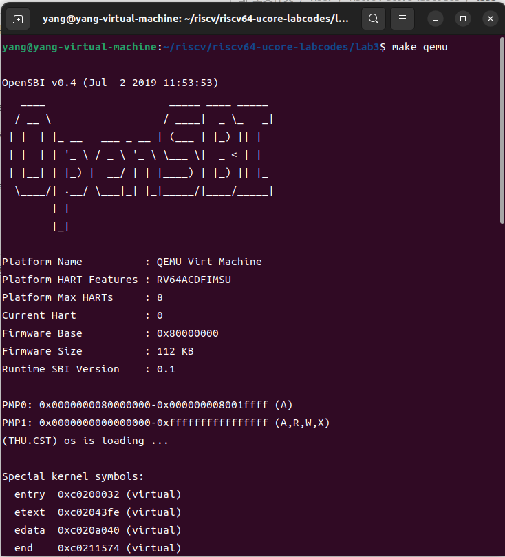
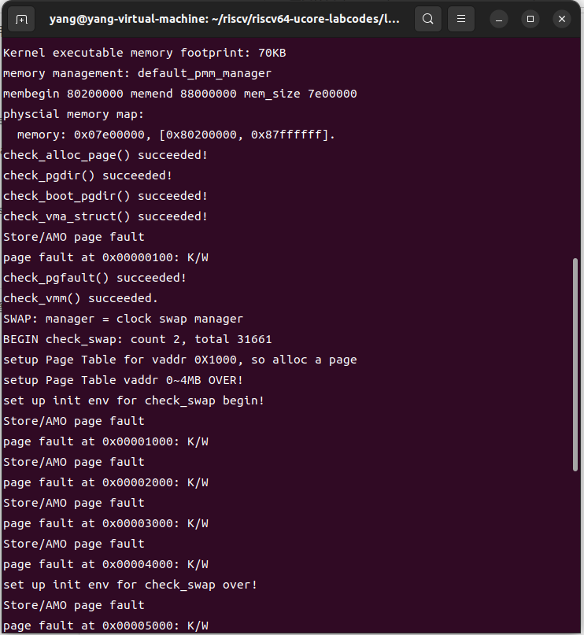
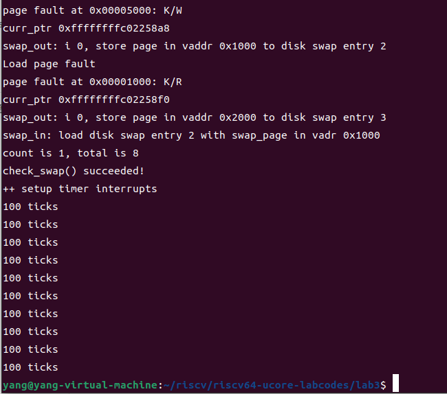
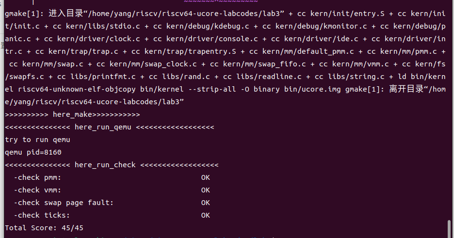

### 练习

对实验报告的要求：
 - 基于markdown格式来完成，以文本方式为主
 - 填写各个基本练习中要求完成的报告内容
 - 完成实验后，请分析ucore_lab中提供的参考答案，并请在实验报告中说明你的实现与参考答案的区别
 - 列出你认为本实验中重要的知识点，以及与对应的OS原理中的知识点，并简要说明你对二者的含义，关系，差异等方面的理解（也可能出现实验中的知识点没有对应的原理知识点）
 - 列出你认为OS原理中很重要，但在实验中没有对应上的知识点
 
#### 练习0：填写已有实验
本实验依赖实验1/2。请把你做的实验1/2的代码填入本实验中代码中有“LAB1”,“LAB2”的注释相应部分。

#### 练习1：理解基于FIFO的页面替换算法（思考题）
描述FIFO页面置换算法下，一个页面从被换入到被换出的过程中，会经过代码里哪些函数/宏的处理（或者说，需要调用哪些函数/宏），并用简单的一两句话描述每个函数在过程中做了什么？（为了方便同学们完成练习，所以实际上我们的项目代码和实验指导的还是略有不同，例如我们将FIFO页面置换算法头文件的大部分代码放在了kern/mm/swap_fifo.c文件中，这点请同学们注意）

至少正确指出10个不同的函数分别做了什么？如果少于10个将酌情给分。我们认为只要函数原型不同，就算两个不同的函数。要求指出对执行过程有实际影响,删去后会导致输出结果不同的函数（例如assert）而不是cprintf这样的函数。如果你选择的函数不能完整地体现”从换入到换出“的过程，比如10个函数都是页面换入的时候调用的，或者解释功能的时候只解释了这10个函数在页面换入时的功能，那么也会扣除一定的分数


### 1. `struct vma_struct`（虚拟内存区域结构体）
```c
struct vma_struct {
    struct mm_struct *vm_mm;      // 指向管理这个VMA的mm_struct结构体
    uintptr_t vm_start;           // VMA的起始地址（包含）
    uintptr_t vm_end;             // VMA的结束地址（不包含）
    uint_t vm_flags;              // VMA的标志（例如读、写、执行权限）
    list_entry_t list_link;       // 链接到VMA链表中的链接节点
};
```
- `vma_struct`表示一个虚拟内存区域（VMA），其范围是一个连续的虚拟地址区间 `[vm_start, vm_end)`。
- `vm_flags` 用于表示这个VMA的权限标志（读、写、执行等），可以与下面的宏一起使用。
- `list_link` 是一个链表节点，用于将多个VMA按起始地址排序链接起来，方便查找。
- `vm_mm` 指向`mm_struct`，它表示一个进程的内存管理结构。

### 2. `struct mm_struct`（内存管理结构体）
```c
struct mm_struct {
    list_entry_t mmap_list;       // 一个按VMA起始地址排序的链表，包含所有VMA
    struct vma_struct *mmap_cache;// 当前访问的VMA，用于加速查找
    pde_t *pgdir;                 // 页目录指针，指向该进程的页表目录
    int map_count;                // 当前VMA的数量
    void *sm_priv;                // 指向与交换管理相关的私有数据
};
```
- `mm_struct`代表进程的内存管理结构体，维护了该进程的所有虚拟内存区域（VMA）和页目录。
- `mmap_list` 是一个链表，保存了与该进程相关的所有VMA，它按虚拟地址的起始位置排序。
- `mmap_cache` 是一个加速访问的缓存，指向当前被访问的VMA。
- `pgdir` 是进程的页目录指针，指向该进程的页表目录，用于虚拟地址到物理地址的映射。
- `map_count` 记录该进程所拥有的VMA数量。
- `sm_priv` 指向与交换管理器相关的私有数据，用于管理页面的交换（例如FIFO交换算法）。


### 1. `_fifo_init_mm`
```c
static int _fifo_init_mm(struct mm_struct *mm)
{     
     list_init(&pra_list_head);
     mm->sm_priv = &pra_list_head;
     return 0;
}
```
- 该函数初始化FIFO页面替换算法的数据结构。它首先通过`list_init`初始化一个双向链表`pra_list_head`，然后将其地址保存在`mm->sm_priv`中。`mm->sm_priv`是`mm_struct`结构体中的一个字段，指向管理页面替换队列的链表。

### 2. `_fifo_map_swappable`
```c
static int _fifo_map_swappable(struct mm_struct *mm, uintptr_t addr, struct Page *page, int swap_in)
{
    list_entry_t *head = (list_entry_t*) mm->sm_priv;
    list_entry_t *entry = &(page->pra_page_link);
 
    assert(entry != NULL && head != NULL);

    // Link the most recent arrival page at the back of the pra_list_head queue.
    list_add(head, entry);
    return 0;
}
```
- 该函数将新加载的页面（`page`）添加到FIFO队列的末尾。它首先获取当前FIFO队列的头指针，然后使用`list_add`将页面的链表节点（`pra_page_link`）添加到队列的末尾，表示该页面是最新加载的。

### 3. `_fifo_swap_out_victim`
```c
static int _fifo_swap_out_victim(struct mm_struct *mm, struct Page **ptr_page, int in_tick)
{
     list_entry_t *head = (list_entry_t*) mm->sm_priv;
     assert(head != NULL);
     assert(in_tick == 0);

     // Select the victim
     list_entry_t* entry = list_prev(head);
     if (entry != head) {
         list_del(entry);
         *ptr_page = le2page(entry, pra_page_link);
     } else {
         *ptr_page = NULL;
     }
     return 0;
}
```
- 该函数选择并淘汰FIFO队列中最旧的页面（即队列头部的页面）。首先，它获取队列头的前一个元素，然后通过`list_del`从队列中删除该页面。`le2page`宏将链表节点转换为`struct Page`类型，并通过`ptr_page`返回被淘汰的页面。


### 1. `swap_out` 函数

#### 功能：
`swap_out` 负责选择页面并将其交换到磁盘。具体操作是选择 `n` 个页面作为受害者，写入交换空间并释放页面。

#### 过程：

- **参数：**
  - `mm`: 当前进程的内存管理结构（`mm_struct`）。
  - `n`: 需要交换出去的页面数量。
  - `in_tick`: 用于标识是否为定时器中断触发的交换，可能与页面替换算法有关。

- **流程：**
  1. **选择受害者页面：** 通过 `sm->swap_out_victim` 函数选择一个页面作为交换的目标（即受害者页面）。如果选择失败，跳出循环。
  2. **获取页表项（PTE）：** 通过 `get_pte(mm->pgdir, v, 0)` 获取页面的页表项。
  3. **写入交换空间：** 将页面写入磁盘交换空间。此操作通过 `swapfs_write` 完成，如果写入失败，恢复页面的交换标志并继续下一轮交换。
  4. **更新页表项：** 成功写入后，更新页表项，将其指向交换空间中的相应条目。
  5. **释放页面：** 释放已交换出的页面，调用 `free_page`。
  6. **TLB 刷新：** 调用 `tlb_invalidate` 刷新 TLB（Translation Lookaside Buffer），以保证页表项的修改能及时生效。

- **返回：** 返回成功交换的页面数量。

#### 代码中的关键操作：
- **`swap_out_victim`**：用于选择一个页面进行交换。
- **`swapfs_write`**：将页面写入交换空间（磁盘）。
- **`get_pte`**：获取页面的页表项。
- **`tlb_invalidate`**：刷新 TLB。

### 2. `swap_in` 函数

#### 功能：
`swap_in` 负责将一个页面从交换空间加载到内存中。

#### 过程：

- **参数：**
  - `mm`: 当前进程的内存管理结构（`mm_struct`）。
  - `addr`: 要加载的虚拟地址。
  - `ptr_result`: 返回加载的页面指针。

- **流程：**
  1. **分配页面：** 通过 `alloc_page` 分配一个新的物理页面。
  2. **获取页表项（PTE）：** 获取虚拟地址 `addr` 对应的页表项。
  3. **从交换空间读取：** 使用 `swapfs_read` 从交换空间读取页面数据到分配的物理页面中。如果读取失败，会触发 `assert`。
  4. **更新结果：** 将加载的页面指针返回给调用者。

- **返回：** 返回 0，表示加载操作成功。

#### 代码中的关键操作：
- **`alloc_page`**：分配一个物理页面。
- **`swapfs_read`**：从交换空间加载页面到物理内存。
- **`get_pte`**：获取页面的页表项。

**主执行流：**init--->swap_init--->check_swap--->check_content_access--->sm->check_swap()--->发生缺页异常--->trap()--->exception_handler--->pgfault_handler--->do_pgfault--->swap_in、page_insert、swap_map_swappable

swap_in分支：swap_in->alloc_page--->alloc_pages--->swap_out--->sm->swap_out_victim

page_insert分支：page_insert--->tlb_validate

这个函数 `do_pgfault` 是操作系统处理页错误的一个核心部分。它负责在发生页错误时，检查并处理虚拟地址是否可以被访问或映射。如果没有有效的映射，它会尝试加载页面、映射物理内存，并进行必要的交换操作。下面是对代码的详细分析和补充说明。

### 函数分析

#### 1. **查找 VMA**
```c
struct vma_struct *vma = find_vma(mm, addr);
```
`find_vma` 函数通过提供的虚拟内存管理结构（`mm`）和地址（`addr`），查找该地址所属的虚拟内存区域（VMA）。VMA 是进程虚拟地址空间的一个区域，定义了虚拟内存的起始和结束地址以及它的属性（如可读、可写）。

#### 2. **检查 VMA 是否有效**
```c
if (vma == NULL || vma->vm_start > addr) {
    cprintf("not valid addr %x, and can not find it in vma\n", addr);
    goto failed;
}
```
如果找不到对应的 VMA 或地址不在有效的 VMA 范围内，直接跳转到失败处理部分。

#### 3. **确定权限**
```c
uint32_t perm = PTE_U;
if (vma->vm_flags & VM_WRITE) {
    perm |= (PTE_R | PTE_W);
}
```
根据 VMA 的标志位（如 `VM_WRITE`）确定该地址的权限。如果该地址是可写的，则权限包括读写（`PTE_R | PTE_W`）；如果是只读的，权限仅包括用户访问（`PTE_U`）。

#### 4. **将地址对齐到页面边界**
```c
addr = ROUNDDOWN(addr, PGSIZE);
```
将地址 `addr` 对齐到页面大小（`PGSIZE`）的边界。

#### 5. **查找或分配页面表条目**
```c
pte_t *ptep = get_pte(mm->pgdir, addr, 1);
```
`get_pte` 函数用于获取给定地址 `addr` 的页表条目（PTE）。如果该页表条目不存在，则会分配一个新的页表。

#### 6. **页面不存在，分配新页面**
```c
if (*ptep == 0) {
    if (pgdir_alloc_page(mm->pgdir, addr, perm) == NULL) {
        cprintf("pgdir_alloc_page in do_pgfault failed\n");
        goto failed;
    }
}
```
如果页表条目为空，说明该虚拟地址没有映射到物理页面。

#### 7. **页表条目指向交换条目，进行交换操作**
```c
else {
    if (swap_init_ok) {
        struct Page *page = NULL;
        swap_in(mm, addr, &page);
        page_insert(mm->pgdir, page, addr, perm);
        swap_map_swappable(mm, addr, page, 1);
        page->pra_vaddr = addr;
    } else {
        cprintf("no swap_init_ok but ptep is %x, failed\n", *ptep);
        goto failed;
    }
}
```
如果页表条目已经存在且指向交换条目（即虚拟页存在但尚未加载到物理内存），则：
1. 调用 `swap_in` 函数从磁盘加载页面内容到内存中。
2. 使用 `page_insert` 将加载的物理页面与虚拟地址进行映射。
3. 调用 `swap_map_swappable` 将该页面标记为可交换（即此页面可以被交换到磁盘上）。
4. 更新页面的虚拟地址 `pra_vaddr`。


#### 练习2：深入理解不同分页模式的工作原理（思考题）
get_pte()函数（位于`kern/mm/pmm.c`）用于在页表中查找或创建页表项，从而实现对指定线性地址对应的物理页的访问和映射操作。这在操作系统中的分页机制下，是实现虚拟内存与物理内存之间映射关系非常重要的内容。
 - get_pte()函数中有两段形式类似的代码， 结合sv32，sv39，sv48的异同，解释这两段代码为什么如此相像。
#### 原因：
##### 异同
sv32，sv39，sv48这些都是RISC-V架构中支持的页表格式，分别用于32位、39位和48位的虚拟地址空间。虽然它们支持的虚拟地址空间大小不同，但它们的页表结构在逻辑上是相似的，都是由多级页表组成的。SV32：包含两级页表，页目录（Page Directory）和页表（Page Table）。SV39：包含三级页表，页目录（Page Directory）、页上级目录（Page Upper Directory）和页表（Page Table）。SV48：也包含三级页表，但每级页表的大小和偏移量字段更大，以支持更大的虚拟地址空间。
##### get_pte函数中的两段代码
`get_pte`中的两段相似的代码分别对应于在第一、第二级页表（PDX1，PDX2）的查找/创建过程。首先 `get_pte`函数使用`PDX1(la)`宏计算虚拟地址la在页上级目录中的索引，并且在页目录中找到对应的地址，并且判断其`PTE-V`标志位是否为真（表示可用）。若可用则继续寻找下一级目录，若不可用则根据 create 的值决定是否调用`alloc_page()`开辟一个新的下一级页表，之后设置引用计数、清零内存、创建页上级目录条目。之后再对下一级页表进行同样的操作，使用`PDX0(la)`宏计算虚拟地址la在页表中的索引，其中通过`PDE_ADDR`得到页表项对应的物理地址。最后根据得到的 pdep0 的页表项找到最低一级页表项的内容并且返回。
###### 相似
由于多级页表的递归性质和页表项设置的相似性，导致在处理这些页表时，代码逻辑上非常相似。

 
 - 目前get_pte()函数将页表项的查找和页表项的分配合并在一个函数里，你认为这种写法好吗？有没有必要把两个功能拆开？
#####可以不拆开
调用者只需要调用一个函数就可以完成页表项的查找（如果存在）或分配（如果不存在），这使得调用逻辑更加简单。


#### 练习3：给未被映射的地址映射上物理页（需要编程）
补充完成do_pgfault（mm/vmm.c）函数，给未被映射的地址映射上物理页。设置访问权限 的时候需要参考页面所在 VMA 的权限，同时需要注意映射物理页时需要操作内存控制 结构所指定的页表，而不是内核的页表。

##### 填写的代码如下
若查找到的页表项并不是 0，则当前页表项地址上存储的是一个一个已经被换到“硬盘”上的页，此时需要使用 `swap_in`将页面换入，并且将换入的页面使用`page_insert`在页表中建立与物理地址的映射，并且使用`swap_map_swappable`调用 swap_manager 中的对应函数以维护页面置换管理。最后，需要将 page->pra_vaddr 设置为 addr。
```c
/*
*swap_in(mm, addr, &page) : 分配一个内存页，然后根据
*PTE中的swap条目的addr，找到磁盘页的地址，将磁盘页的内容读入这个内存页
*page_insert ： 建立一个Page的phy addr与线性addr la的映射
*swap_map_swappable ： 设置页面可交换
*/
 swap_in(mm,addr,&page);
 page_insert(mm->pgdir,page,addr,perm);
 swap_map_swappable(mm,addr,page,1);

```

请在实验报告中简要说明你的设计实现过程。请回答如下问题：
 - 请描述页目录项（Page Directory Entry）和页表项（Page Table Entry）中组成部分对ucore实现页替换算法的潜在用处。
##### 用处：
页目录项和页表项中低八位用于表示页表项的属性和权限，包含了页面的状态信息，如是否合法、页面的访问权限等。当一个页面被换出时，页表项位置的值会被如下设置：`*ptep = (page->pra_vaddr / PGSIZE + 1) << 8`;这会将对应页的虚拟页号加一并左移，保证其低八位为 0，并且整个值不为 0（表示是换出而不是被新建）。页表项记录了虚拟地址到物理地址的映射，mmu需要通过页表项才能获得虚拟地址对应的物理地址。在 sv39 中，页表项中的一些标记位和保留位（RSW）可以在页替换算法中用于实现一些功能。例如，A (Accessed) 可以表示一个页是否被访问（写或读）过，D (Dirty) 表示页是否被修改（写入）过，这两个标记位可以用于实现扩展的 Clock 页面置换算法。

 - 如果ucore的缺页服务例程在执行过程中访问内存，出现了页访问异常，请问硬件要做哪些事情？
#####硬件
当出现页访问异常时，此时会固定的跳转到初始化stvec时设置好的处理程序地址，也即`__alltraps`处，进行上下文保存，以及将发生缺页中断的地址保存到trapframe中。然后跳转到中断处理函数`trap()`，具体由`do_pgfault`处理，解决完毕返回到`__trapret`恢复保存的寄存器。也即上下文，通过sret跳转回原程序。我们的trapFrame传递了badvaddr给do_pgfault()函数，而这实际上是stval这个寄存器的数值（在旧版的RISCV标准里叫做sbadvaddr)，这个寄存器存储一些关于异常的数据，对于PageFault它存储的是访问出错的虚拟地址。

- 数据结构Page的全局变量（其实是一个数组）的每一项与页表中的页目录项和页表项有无对应关系？如果有，其对应关系是啥？
##### Page 与页目录项、页表项的对应关系
Page数组的全局变量在操作系统中用于描述物理内存中的各个页面。每个Page数组的项都包含了一个物理页的相关信息，如该页是否已被分配、是否有效等。页目录项和页表项是分页式内存管理中的重要组成部分。页目录项通常指向一个页表，而页表项则指向具体的物理页面。当页目录项有效时，它指向一个页表。这个页表实际上也是由Page数组中的某个项描述的物理页所存储的。换句话说，页目页表项则直接指向具体的物理页面。这个物理页面同样由Page数组中的某个项来描述。因此，页表项保存的物理页面地址也对应于Page数组中的某一页。录项保存的物理页面地址（即某个页表）对应于Page数组中的某一页。Sv39 分页机制下，每一个页表所占用的空间刚好为一个页的大小。

#### 练习4：补充完成Clock页替换算法（需要编程）
通过之前的练习，相信大家对FIFO的页面替换算法有了更深入的了解，现在请在我们给出的框架上，填写代码，实现 Clock页替换算法（mm/swap_clock.c）。
请在实验报告中简要说明你的设计实现过程。请回答如下问题：
 - 比较Clock页替换算法和FIFO算法的不同。

##### 填写的代码如下
使用list_init初始化pra_list_head为空链表，令curr_ptr指向表头，将mm的私有成员指针指向pra_list_head
```
/*
 * (2) _fifo_init_mm: init pra_list_head and let  mm->sm_priv point to the addr of pra_list_head.
 *              Now, From the memory control struct mm_struct, we can access FIFO PRA
 */
static int
_clock_init_mm(struct mm_struct *mm)
{     
     /*LAB3 EXERCISE 4: YOUR CODE*/ 
     // 初始化pra_list_head为空链表
     // 初始化当前指针curr_ptr指向pra_list_head，表示当前页面替换位置为链表头
     // 将mm的私有成员指针指向pra_list_head，用于后续的页面替换算法操作
     //cprintf(" mm->sm_priv %x in fifo_init_mm\n",mm->sm_priv);
     
     list_init(&pra_list_head);
     curr_ptr = &pra_list_head;
     mm->sm_priv = &pra_list_head;
     
     return 0;
}

```

设置页面可交换，表示当前页面正要被使用，将其添加到链表尾部并设置visited
```
/*
 * (3)_fifo_map_swappable: According FIFO PRA, we should link the most recent arrival page at the back of pra_list_head qeueue
 */
static int
_clock_map_swappable(struct mm_struct *mm, uintptr_t addr, struct Page *page, int swap_in)
{
    list_entry_t *entry=&(page->pra_page_link);
 
    assert(entry != NULL && curr_ptr != NULL);
    //record the page access situlation
    /*LAB3 EXERCISE 4: YOUR CODE*/ 
    // link the most recent arrival page at the back of the pra_list_head qeueue.
    // 将页面page插入到页面链表pra_list_head的末尾
    // 将页面的visited标志置为1，表示该页面已被访问
    
    list_entry_t *head=(list_entry_t*) mm->sm_priv;
    list_add(head, entry);
    page->visited = 1;   
    
    return 0;
}
```
在循环开始时检查当前指针是否回到链表的头部。如果是头部，curr_ptr 被更新为头部的前一个节点并跳过当前循环，继续检查下一个页面。

如果当前页面未被访问过（visited == 0），则打印当前页面指针（cprintf），更新 curr_ptr 为当前页面的前一个节点（curr_ptr = list_prev(curr_ptr)），从链表中删除当前页面（list_del(list_next(curr_ptr))）。这里需要注意，删除的是 list_next(curr_ptr)，这意味着删除的是当前页面的下一个节点，而 curr_ptr 已经被更新为前一个节点。将该页面赋给 ptr_page，并返回 0，结束循环。

如果当前页面已经被访问过（visited == 1），则将其 visited 标志重置为 0，表示该页面已被重新访问。然后继续将 curr_ptr 更新为当前页面的前一个节点，继续遍历下一个页面。
```
/*
 *  (4)_fifo_swap_out_victim: According FIFO PRA, we should unlink the  earliest arrival page in front of pra_list_head qeueue,
 *                            then set the addr of addr of this page to ptr_page.
 */
static int
_clock_swap_out_victim(struct mm_struct *mm, struct Page ** ptr_page, int in_tick)
{
     list_entry_t *head=(list_entry_t*) mm->sm_priv;
     assert(head != NULL);
     assert(in_tick==0);
     /* Select the victim */
     //(1)  unlink the  earliest arrival page in front of pra_list_head qeueue
     //(2)  set the addr of addr of this page to ptr_page
    while (1) {
        /*LAB3 EXERCISE 4: YOUR CODE*/ 
        // 编写代码
        // 遍历页面链表pra_list_head，查找最早未被访问的页面
        // 获取当前页面对应的Page结构指针
        // 如果当前页面未被访问，则将该页面从页面链表中删除，并将该页面指针赋值给ptr_page作为换出页面
        // 如果当前页面已被访问，则将visited标志置为0，表示该页面已被重新访问
        if(curr_ptr == head){
            curr_ptr = list_prev(curr_ptr);
            continue;
        }
        struct Page* curr_page = le2page(curr_ptr,pra_page_link);
        if(curr_page->visited == 0){
            cprintf("curr_ptr %p\n", curr_ptr);
            curr_ptr = list_prev(curr_ptr);
            list_del(list_next(curr_ptr));
            *ptr_page = curr_page;
            return 0;
        }
        curr_page->visited = 0;
        curr_ptr = list_prev(curr_ptr);
    }
    return 0;
}
```

##### 运行结果如下
make qemu后




make grade后



##### Clock页替换算法和FIFO算法的不同

FIFO 是一种非常简单的页面替换算法，它没有考虑页面的访问历史，仅仅根据页面进入内存的时间顺序来决定替换哪个页面。即最早进入内存的页面将最早被淘汰，而最后进入内存的页面将最后被淘汰。它的主要缺点是无法避免 Belady's anomaly，可能会导致较高的缺页率。

Clock 算法则是对 FIFO 的一种优化，考虑了页面的访问情况，减少了不常用页面被替换的概率，因此在大多数情况下，它比 FIFO 更加高效。它通过模拟环形链表的方式，类似时钟的机制和访问位来做页面替换，通常能够避免 FIFO 的缺陷，提供更好的性能。

#### 练习5：阅读代码和实现手册，理解页表映射方式相关知识（思考题）
如果我们采用”一个大页“ 的页表映射方式，相比分级页表，有什么好处、优势，有什么坏处、风险？

##### 好处：
1.更高效的内存访问，减少多级页表查找：当使用大页时，虚拟地址到物理地址的映射更加直接，从而减少了在分级页表中多级查找的开销。大页可能使得内存访问更加高效，尤其是对于内存密集型应用程序。

2.提高TLB命中率，减少TLB缺失：在一个大页中，相同的页表条目可以映射更多的虚拟地址，这意味着只有较少的页表条目需要在TLB中缓存。这可以降低TLB缓存失效的概率，提高内存访问性能。


##### 坏处：

1.内存碎片：操作系统需要分配连续的物理内存来满足大页的需求。这可能会导致内存资源浪费和不规则的内存分配。

2.更复杂的内存管理：大页的管理会比分级页表需要更多的操作系统支持和硬件复杂性，包括处理页错误和页面交换。

3.不灵活：大页不适合小内存需求的应用程序。

#### 扩展练习 Challenge：实现不考虑实现开销和效率的LRU页替换算法（需要编程）
challenge部分不是必做部分，不过在正确最后会酌情加分。需写出有详细的设计、分析和测试的实验报告。完成出色的可获得适当加分。


